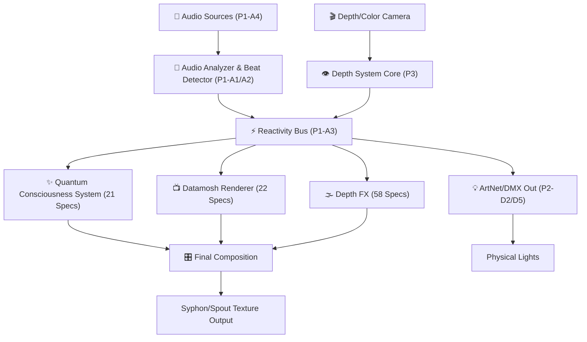

# VJLive3 Global Architecture Map (Phase 3 Approval)

This document represents the consolidated, global analysis of the 109 fleshed-out specs in `docs/specs/_02_fleshed_out/`. No code will be written in Phase 4 until this diagram is approved.

## Subsystem Breakdown
- **Audio System (54 Specs)**: Beats, spectrum analysis, Reactivity Bus.
- **Depth System (58 Specs)**: Point clouds, meshes, subtraction, temporal echo.
- **Datamosh System (22 Specs)**: Video distortion, i-frame deletion, contour moshing.
- **Quantum/Consciousness (21 Specs)**: State trackers, neural network layers, parallel universe depth.
- **Lighting & Output (4 Specs)**: ArtNet, DMX, Show Control, Projection Mapping.

## Approval Gate
If the macro groupings (Audio -> Reactivity -> FX -> Output) and subsystem relationships are accurate, this architecture will be locked in as the source of truth for Phase 4 Execution.
