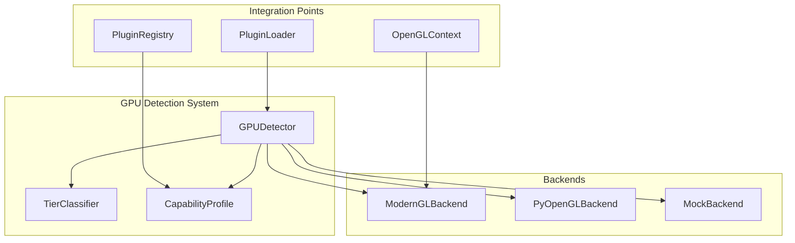

# GPU Capability Detection System - Architecture Design

**Task:** GPU Capability Detection System  
**Priority:** P0  
**Deadline:** 2026-02-22  
**Author:** Roo Code (Architect)  
**Date:** 2026-02-21

---

## 1. System Overview

The GPU Capability Detection System provides automatic detection of GPU capabilities and classification into tiers (NONE, LOW, MEDIUM, HIGH, ULTRA) to support the gpu_tier licensing model and capability-aware plugin loading.

### Core Requirements
- Detect OpenGL version, extensions, GPU vendor/model
- Classify GPU into predefined tiers
- Provide singleton access with caching
- Support headless/fallback modes
- Integrate with ModernGL and PyOpenGL
- Enable plugin filtering based on tier requirements

---

## 2. Architecture

### 2.1 Component Diagram



### 2.2 Class Design

#### `GPUDetector` (Singleton)

```python
class GPUDetector:
    """Singleton GPU capability detector with fallback support."""
    
    _instance: Optional['GPUDetector'] = None
    _lock: threading.RLock = threading.RLock()
    
    @classmethod
    def get_instance(cls) -> 'GPUDetector':
        """Get or create the singleton instance."""
        with cls._lock:
            if cls._instance is None:
                cls._instance = cls()
            return cls._instance
    
    def __init__(self) -> None:
        """Initialize detector (called only by get_instance)."""
        if GPUDetector._instance is not None:
            raise RuntimeError("GPUDetector is a singleton. Use get_instance().")
        
        self._profile: Optional[CapabilityProfile] = None
        self._detected: bool = False
        self._backend: Optional[Backend] = None
        self._lock = threading.RLock()
    
    def detect(self, force: bool = False) -> CapabilityProfile:
        """
        Perform GPU capability detection.
        
        Args:
            force: Re-run detection even if already detected
            
        Returns:
            CapabilityProfile with detected capabilities
            
        Note:
            Non-blocking - falls back to mock detection on failure.
            Results are cached for subsequent calls.
        """
        with self._lock:
            if self._detected and not force:
                return self._profile
            
            profile = self._try_detect()
            self._profile = profile
            self._detected = True
            return profile
    
    def get_profile(self) -> CapabilityProfile:
        """
        Get the current capability profile.
        
        Returns:
            CapabilityProfile (triggers detection if not yet done)
            
        Raises:
            RuntimeError: If detection fails and no fallback available
        """
        if self._profile is None:
            return self.detect()
        return self._profile
    
    def get_tier(self) -> GPU_TIER:
        """Get the current GPU tier classification."""
        profile = self.get_profile()
        return TierClassifier.classify(profile)
    
    def can_run_tier(self, required_tier: GPU_TIER) -> bool:
        """
        Check if the current system can run plugins requiring the given tier.
        
        Args:
            required_tier: The required GPU tier
            
        Returns:
            True if system meets or exceeds the requirement
        """
        current = self.get_tier()
        return self._tier_meets_requirement(current, required_tier)
    
    def _try_detect(self) -> CapabilityProfile:
        """Attempt detection using available backends with fallback."""
        # Try ModernGL first (if context exists or can be created)
        try:
            import moderngl
            self._backend = ModernGLBackend()
            profile = self._backend.detect()
            if profile:
                return profile
        except ImportError:
            logger.warning("ModernGL not available, trying PyOpenGL...")
        except Exception as exc:
            logger.warning(f"ModernGL detection failed: {exc}, trying PyOpenGL...")
        
        # Try PyOpenGL fallback
        try:
            self._backend = PyOpenGLBackend()
            profile = self._backend.detect()
            if profile:
                return profile
        except ImportError:
            logger.warning("PyOpenGL not available, using mock detection...")
        except Exception as exc:
            logger.warning(f"PyOpenGL detection failed: {exc}, using mock detection...")
        
        # Final fallback: mock detection (headless-safe)
        self._backend = MockBackend()
        profile = self._backend.detect()
        return profile
    
    @staticmethod
    def _tier_meets_requirement(
        current_tier: GPU_TIER, 
        required_tier: GPU_TIER
    ) -> bool:
        """Check if current tier meets or exceeds required tier."""
        tier_order = [
            GPU_TIER.NONE,
            GPU_TIER.LOW,
            GPU_TIER.MEDIUM,
            GPU_TIER.HIGH,
            GPU_TIER.ULTRA
        ]
        current_idx = tier_order.index(current_tier)
        required_idx = tier_order.index(required_tier)
        return current_idx >= required_idx
```

#### `CapabilityProfile` (Dataclass)

```python
@dataclass(frozen=True)
class CapabilityProfile:
    """Immutable GPU capability snapshot."""
    
    # OpenGL version
    opengl_version_major: int
    opengl_version_minor: int
    opengl_version: Tuple[int, int]  # Computed property
    
    # Extensions
    extensions: Set[str]  # Set of available GL extension strings
    
    # GPU identification
    vendor: str  # e.g., "NVIDIA", "AMD", "Intel", "Unknown"
    renderer: str  # e.g., "GeForce RTX 4090", "Radeon RX 7900 XTX"
    gpu_model: str  # Simplified model name
    
    # Memory (if detectable, else 0)
    vram_bytes: int
    vram_gb: float  # Computed property
    
    # Detection metadata
    detection_method: str  # "moderngl", "pyopengl", "mock"
    is_headless: bool
    context_created: bool
    
    # Tier (computed lazily)
    _tier: Optional[GPU_TIER] = field(default=None, compare=False, hash=False)
    
    def get_tier(self) -> GPU_TIER:
        """Get the tier classification for this profile."""
        if self._tier is None:
            self._tier = TierClassifier.classify(self)
        return self._tier
    
    def has_extension(self, ext: str) -> bool:
        """Check if a specific extension is available."""
        return ext in self.extensions
    
    def supports_version(self, major: int, minor: int) -> bool:
        """Check if OpenGL version meets or exceeds the specified version."""
        if self.opengl_version_major > major:
            return True
        if self.opengl_version_major == major:
            return self.opengl_version_minor >= minor
        return False
```

#### `TierClassifier` (Static Class)

```python
class TierClassifier:
    """Classifies GPU capabilities into tiers."""
    
    # Tier thresholds configuration
    TIER_SPECS = {
        GPU_TIER.NONE: {
            'min_opengl_version': (0, 0),
            'required_extensions': set(),
            'min_vram_gb': 0,
            'description': 'No GPU or headless mode'
        },
        GPU_TIER.LOW: {
            'min_opengl_version': (3, 3),
            'required_extensions': set(),
            'min_vram_gb': 0,
            'description': 'OpenGL 3.3, basic effects only'
        },
        GPU_TIER.MEDIUM: {
            'min_opengl_version': (4, 0),
            'required_extensions': {
                'GL_ARB_compute_shader',
                'GL_EXT_texture_filter_anisotropic'
            },
            'min_vram_gb': 2,
            'description': 'OpenGL 4.0+ with compute shaders and anisotropy'
        },
        GPU_TIER.HIGH: {
            'min_opengl_version': (4, 5),
            'required_extensions': {
                'GL_ARB_compute_shader',
                'GL_ARB_gpu_shader_fp64',
                'GL_EXT_texture_filter_anisotropic',
                'GL_ARB_direct_state_access'
            },
            'min_vram_gb': 4,
            'description': 'OpenGL 4.5+ with most advanced extensions'
        },
        GPU_TIER.ULTRA: {
            'min_opengl_version': (4, 6),
            'required_extensions': {
                'GL_ARB_compute_shader',
                'GL_ARB_gpu_shader_fp64',
                'GL_ARB_gpu_shader_int64',
                'GL_EXT_texture_filter_anisotropic',
                'GL_ARB_direct_state_access',
                'GL_NV_mesh_shader',  # NVIDIA-specific
                'GL_NV_ray_tracing'   # NVIDIA-specific
            },
            'min_vram_gb': 8,
            'description': 'Latest OpenGL with all advanced extensions'
        }
    }
    
    @classmethod
    def classify(cls, profile: CapabilityProfile) -> GPU_TIER:
        """
        Classify a capability profile into the highest tier it qualifies for.
        
        Args:
            profile: The GPU capability profile to classify
            
        Returns:
            The highest GPU_TIER the system meets requirements for
        """
        # Check from highest to lowest tier
        for tier in [GPU_TIER.ULTRA, GPU_TIER.HIGH, GPU_TIER.MEDIUM, GPU_TIER.LOW]:
            if cls._meets_tier(profile, tier):
                return tier
        
        # If no tier matched, it's NONE
        return GPU_TIER.NONE
    
    @classmethod
    def _meets_tier(cls, profile: CapabilityProfile, tier: GPU_TIER) -> bool:
        """Check if profile meets all requirements for a specific tier."""
        spec = cls.TIER_SPECS[tier]
        
        # Check OpenGL version
        if not profile.supports_version(*spec['min_opengl_version']):
            return False
        
        # Check required extensions
        required_exts = spec['required_extensions']
        if not all(profile.has_extension(ext) for ext in required_exts):
            return False
        
        # Check VRAM (if detectable)
        if profile.vram_gb < spec['min_vram_gb']:
            return False
        
        return True
```

#### Backend Interface

```python
class Backend(ABC):
    """Abstract base class for GPU detection backends."""
    
    @abstractmethod
    def detect(self) -> Optional[CapabilityProfile]:
        """
        Perform detection and return a capability profile.
        
        Returns:
            CapabilityProfile if detection successful, None if this backend
            cannot detect (e.g., no GPU present)
        """
        pass


class ModernGLBackend(Backend):
    """Detection using ModernGL (preferred, requires active context)."""
    
    def detect(self) -> Optional[CapabilityProfile]:
        try:
            import moderngl
            
            # Try to get/create a context
            ctx = moderngl.create_context(require=330)
            if ctx is None:
                logger.warning("ModernGL: Could not create context")
                return None
            
            # Extract version
            version = ctx.version_code
            major = version // 100
            minor = (version % 100) // 10
            
            # Get extensions
            extensions = set(ctx.extensions)
            
            # Get vendor/renderer
            vendor = ctx.info['GL_VENDOR']
            renderer = ctx.info['GL_RENDERER']
            
            # Try to estimate VRAM (ModernGL doesn't expose this directly)
            vram_bytes = self._estimate_vram(vendor, renderer)
            
            # Clean up temporary context if we created one
            if not self._is_existing_context(ctx):
                ctx.release()
            
            return CapabilityProfile(
                opengl_version_major=major,
                opengl_version_minor=minor,
                extensions=extensions,
                vendor=vendor,
                renderer=renderer,
                gpu_model=self._parse_model(renderer),
                vram_bytes=vram_bytes,
                detection_method='moderngl',
                is_headless=False,
                context_created=not self._is_existing_context(ctx)
            )
        except Exception as exc:
            logger.debug(f"ModernGL backend error: {exc}")
            return None
    
    def _is_existing_context(self, ctx: moderngl.Context) -> bool:
        """Check if we're using an already-existing context."""
        # If context was created by create_context(), it's new
        # If it was obtained via Context(ctx), it's existing
        # For simplicity, we assume any context we get is new unless we're
        # passed one (which we don't currently support)
        return False
    
    def _estimate_vram(self, vendor: str, renderer: str) -> int:
        """Estimate VRAM based on GPU model (rough heuristic)."""
        # This is a fallback when we can't query actual VRAM
        # Returns bytes
        vendor_lower = vendor.lower()
        renderer_lower = renderer.lower()
        
        # Known high-end GPUs
        if 'rtx 4090' in renderer_lower or 'rx 7900' in renderer_lower:
            return 24 * 1024**3
        elif 'rtx 4080' in renderer_lower or 'rx 7800' in renderer_lower:
            return 16 * 1024**3
        elif 'rtx 4070' in renderer_lower or 'rx 7700' in renderer_lower:
            return 12 * 1024**3
        elif 'rtx 3090' in renderer_lower or 'rx 6800' in renderer_lower:
            return 24 * 1024**3
        elif 'rtx 3080' in renderer_lower or 'rx 6700' in renderer_lower:
            return 12 * 1024**3
        
        # Default estimate for modern GPUs
        if any(word in renderer_lower for word in ['geforce', 'radeon', 'arc']):
            return 8 * 1024**3
        
        return 0
    
    def _parse_model(self, renderer: str) -> str:
        """Extract a simplified GPU model name from renderer string."""
        renderer_lower = renderer.lower()
        
        # NVIDIA patterns
        if 'nvidia' in vendor.lower() or 'geforce' in renderer_lower:
            # Extract RTX/GTX pattern
            import re
            match = re.search(r'(rtx|gtx) [a-z0-9]+', renderer_lower)
            if match:
                return match.group(0).upper()
        
        # AMD patterns
        elif 'amd' in vendor.lower() or 'radeon' in renderer_lower:
            import re
            match = re.search(r'rx [a-z0-9]+', renderer_lower)
            if match:
                return match.group(0).upper()
        
        # Intel patterns
        elif 'intel' in vendor.lower():
            if 'arc' in renderer_lower:
                return 'Intel Arc'
            elif 'iris' in renderer_lower:
                return 'Intel Iris'
            elif 'uhd' in renderer_lower:
                return 'Intel UHD Graphics'
        
        # Fallback: return first part of renderer string
        return renderer.split()[0] if renderer else 'Unknown'


class PyOpenGLBackend(Backend):
    """Detection using PyOpenGL (fallback, can work without context)."""
    
    def detect(self) -> Optional[CapabilityProfile]:
        try:
            from OpenGL import GL
            
            # Try to create a dummy context if none exists
            # This is tricky - PyOpenGL needs a context for some queries
            # We'll try to get info without context first
            try:
                vendor = GL.glGetString(GL.GL_VENDOR).decode('utf-8')
                renderer = GL.glGetString(GL.GL_RENDERER).decode('utf-8')
                version_str = GL.glGetString(GL.GL_VERSION).decode('utf-8')
            except Exception:
                # No context available
                logger.warning("PyOpenGL: No active OpenGL context")
                return None
            
            # Parse version
            import re
            match = re.search(r'(\d+)\.(\d+)', version_str)
            if not match:
                major, minor = 0, 0
            else:
                major, minor = int(match.group(1)), int(match.group(2))
            
            # Get extensions (requires context)
            try:
                ext_count = GL.glGetIntegerv(GL.GL_NUM_EXTENSIONS)
                extensions = {
                    GL.glGetStringi(GL.GL_EXTENSIONS, i).decode('utf-8')
                    for i in range(ext_count)
                }
            except Exception:
                extensions = set()
            
            # VRAM not available via PyOpenGL without platform-specific calls
            vram_bytes = 0
            
            return CapabilityProfile(
                opengl_version_major=major,
                opengl_version_minor=minor,
                extensions=extensions,
                vendor=vendor,
                renderer=renderer,
                gpu_model=self._parse_model(renderer),
                vram_bytes=vram_bytes,
                detection_method='pyopengl',
                is_headless=False,
                context_created=False
            )
        except ImportError:
            return None
        except Exception as exc:
            logger.debug(f"PyOpenGL backend error: {exc}")
            return None
    
    def _parse_model(self, renderer: str) -> str:
        # Same as ModernGLBackend._parse_model
        renderer_lower = renderer.lower()
        vendor = GL.glGetString(GL.GL_VENDOR).decode('utf-8')
        
        if 'nvidia' in vendor.lower() or 'geforce' in renderer_lower:
            import re
            match = re.search(r'(rtx|gtx) [a-z0-9]+', renderer_lower)
            if match:
                return match.group(0).upper()
        elif 'amd' in vendor.lower() or 'radeon' in renderer_lower:
            import re
            match = re.search(r'rx [a-z0-9]+', renderer_lower)
            if match:
                return match.group(0).upper()
        elif 'intel' in vendor.lower():
            if 'arc' in renderer_lower:
                return 'Intel Arc'
            elif 'iris' in renderer_lower:
                return 'Intel Iris'
            elif 'uhd' in renderer_lower:
                return 'Intel UHD Graphics'
        
        return renderer.split()[0] if renderer else 'Unknown'


class MockBackend(Backend):
    """Fallback detection for headless environments or when all else fails."""
    
    def detect(self) -> CapabilityProfile:
        """Return a safe default profile."""
        logger.warning("Using mock GPU detection - actual capabilities unknown")
        
        # Check environment variables for hints
        import os
        headless = bool(os.environ.get('DISPLAY') is None or 
                       os.environ.get('WAYLAND_DISPLAY') is None)
        
        # If we're in CI or headless, assume minimal capabilities
        if headless or os.environ.get('CI') == 'true':
            return CapabilityProfile(
                opengl_version_major=3,
                opengl_version_minor=3,
                extensions=set(),
                vendor='Unknown',
                renderer='Software (Headless)',
                gpu_model='Software',
                vram_bytes=0,
                detection_method='mock',
                is_headless=True,
                context_created=False
            )
        
        # If we have a display but couldn't detect, assume LOW tier
        # This is conservative but safe
        return CapabilityProfile(
            opengl_version_major=3,
            opengl_version_minor=3,
            extensions=set(),
            vendor='Unknown',
            renderer='Unknown (Default)',
            gpu_model='Unknown',
            vram_bytes=0,
            detection_method='mock',
            is_headless=False,
            context_created=False
        )
```

---

## 3. Integration with Plugin System

### 3.1 Plugin Loader Integration

The `PluginLoader` will be enhanced to filter plugins based on GPU tier:

```python
class PluginLoader:
    def __init__(
        self,
        context: PluginContext,
        plugin_dirs: List[str] = None,
        gpu_detector: Optional[GPUDetector] = None,
    ) -> None:
        self.context = context
        self.gpu_detector = gpu_detector or GPUDetector.get_instance()
        # ... existing init ...
    
    def load_plugin(self, manifest: PluginManifest) -> bool:
        """Load a single plugin with GPU tier filtering."""
        # NEW: Check GPU tier requirement
        required_tier_str = manifest.manifest.get('gpu_tier', 'NONE')
        try:
            required_tier = GPU_TIER(required_tier_str)
        except ValueError:
            logger.warning(f"Plugin {manifest.name}: Invalid gpu_tier '{required_tier_str}', defaulting to NONE")
            required_tier = GPU_TIER.NONE
        
        if not self.gpu_detector.can_run_tier(required_tier):
            logger.info(
                f"Plugin {manifest.name} requires GPU tier {required_tier.value}, "
                f"but system only has {self.gpu_detector.get_tier().value} - skipping"
            )
            return False
        
        # ... existing load logic ...
```

### 3.2 Plugin Registry Integration

The `PluginRegistry.get_all_modules()` already includes `gpu_tier` from the manifest (line 328). This remains unchanged, but now the `gpu_tier` field becomes meaningful for UI filtering.

### 3.3 API for Querying Capabilities

Add to `vjlive3.plugins.api`:

```python
from vjlive3.plugins.gpu_detector import GPUDetector, GPU_TIER, CapabilityProfile

def get_gpu_capabilities() -> CapabilityProfile:
    """Get the current system GPU capability profile."""
    return GPUDetector.get_instance().get_profile()

def get_gpu_tier() -> GPU_TIER:
    """Get the current GPU tier classification."""
    return GPUDetector.get_instance().get_tier()

def can_run_gpu_tier(required_tier: Union[str, GPU_TIER]) -> bool:
    """Check if the system can run plugins requiring the specified tier."""
    if isinstance(required_tier, str):
        required_tier = GPU_TIER(required_tier)
    return GPUDetector.get_instance().can_run_tier(required_tier)
```

---

## 4. Tier Classification Algorithm

### 4.1 Tier Thresholds

| Tier | OpenGL | Required Extensions | VRAM Min | Description |
|------|--------|---------------------|----------|-------------|
| NONE | Any | None | 0 | No GPU, headless, or software rendering |
| LOW | 3.3+ | None | 0 | Basic effects, no special features |
| MEDIUM | 4.0+ | `GL_ARB_compute_shader`, `GL_EXT_texture_filter_anisotropic` | 2 GB | Modern effects with compute shaders |
| HIGH | 4.5+ | + `GL_ARB_gpu_shader_fp64`, `GL_ARB_direct_state_access` | 4 GB | Advanced effects with DSA and double precision |
| ULTRA | 4.6+ | + `GL_ARB_gpu_shader_int64`, `GL_NV_mesh_shader`, `GL_NV_ray_tracing` | 8 GB | Cutting-edge features, ray tracing, mesh shaders |

### 4.2 Classification Logic

The `TierClassifier.classify()` method checks tiers from highest to lowest and returns the first tier whose requirements are fully satisfied. This ensures that a GPU qualifying for ULTRA will also qualify for HIGH, MEDIUM, and LOW, but we always return the highest.

**Requirements must ALL be satisfied:**
- OpenGL version >= tier minimum
- ALL required extensions present
- VRAM >= tier minimum (if detectable)

### 4.3 Extension Importance

The chosen extensions represent key capabilities:
- **Compute shaders**: General-purpose GPU computation (essential for advanced effects)
- **Anisotropic filtering**: Improved texture quality (standard on modern GPUs)
- **Direct State Access (DSA)**: More efficient GPU resource management
- **Double precision**: High-precision calculations (scientific/audio analysis)
- **64-bit integers**: Large buffer support (AI/ML plugins)
- **Mesh shaders**: Advanced geometry processing (next-gen rendering)
- **Ray tracing**: Hardware-accelerated ray tracing (premium effects)

---

## 5. Fallback and Error Handling Strategy

### 5.1 Detection Fallback Chain

1. **ModernGL Backend** (preferred)
   - Requires: `moderngl` package
   - Requires: Active OpenGL context (from `OpenGLContext`)
   - Best accuracy, can query all capabilities
   - Creates temporary context if needed (but prefers existing)

2. **PyOpenGL Backend** (fallback #1)
   - Requires: `PyOpenGL` package
   - Can work with or without context (limited without)
   - Good accuracy for version/vendor, poor for extensions without context
   - No VRAM detection

3. **Mock Backend** (final fallback)
   - No dependencies required
   - Always succeeds
   - Returns conservative defaults (OpenGL 3.3, no extensions, unknown GPU)
   - Safe for headless/CI environments

### 5.2 Error Handling Principles

- **Never crash on detection failure**: Always fall back to next backend
- **Log appropriately**: Warnings for fallbacks, debug for details
- **Cache results**: Once detected (even as mock), don't retry unless forced
- **Thread-safe**: All public methods use `RLock`
- **Graceful degradation**: System continues with reduced capability awareness

### 5.3 Headless Environment Support

- Detection works without a display using mock backend
- Mock backend checks `DISPLAY`/`WAYLAND_DISPLAY` env vars
- CI environments set `CI=true` to force mock mode if needed
- No blocking on context creation in headless mode

---

## 6. API Surface

### 6.1 Public Classes

```python
# gpu_detector.py
class GPUDetector:
    @classmethod
    def get_instance() -> GPUDetector
    def detect(force: bool = False) -> CapabilityProfile
    def get_profile() -> CapabilityProfile
    def get_tier() -> GPU_TIER
    def can_run_tier(required_tier: GPU_TIER) -> bool

class CapabilityProfile:
    # Data class with fields:
    # - opengl_version_major, opengl_version_minor
    # - extensions: Set[str]
    # - vendor, renderer, gpu_model
    # - vram_bytes
    # - detection_method, is_headless, context_created
    def get_tier() -> GPU_TIER
    def has_extension(ext: str) -> bool
    def supports_version(major: int, minor: int) -> bool

class GPU_TIER(Enum):
    NONE = "NONE"
    LOW = "LOW"
    MEDIUM = "MEDIUM"
    HIGH = "HIGH"
    ULTRA = "ULTRA"

class Backend(ABC):
    @abstractmethod
    def detect() -> Optional[CapabilityProfile]
```

### 6.2 Module-Level Convenience Functions

```python
# vjlive3/plugins/gpu_detector.py
def get_gpu_profile() -> CapabilityProfile:
    """Quick access to GPU profile (singleton)."""
    return GPUDetector.get_instance().get_profile()

def get_current_gpu_tier() -> GPU_TIER:
    """Quick access to current GPU tier."""
    return GPUDetector.get_instance().get_tier()

def gpu_supports_tier(tier: Union[str, GPU_TIER]) -> bool:
    """Check if current GPU meets tier requirement."""
    return GPUDetector.get_instance().can_run_tier(tier)
```

### 6.3 Integration Hooks

- `PluginLoader.__init__` accepts optional `gpu_detector` parameter
- `PluginLoader.load_plugin()` checks tier before loading
- `PluginRegistry.get_all_modules()` already includes `gpu_tier` from manifest

---

## 7. Implementation Plan

### 7.1 File Structure

```
src/vjlive3/plugins/
    __init__.py           # Add GPU detector exports
    gpu_detector.py       # NEW: Main detector, ~400 lines
    api.py                # MODIFY: Add convenience functions
    loader.py             # MODIFY: Add tier filtering
    
tests/unit/
    test_gpu_detector.py  # NEW: Comprehensive unit tests
    
docs/
    architecture/
        gpu_detector_design.md  # This document
```

### 7.2 Implementation Phases

#### Phase 1: Core Detector (gpu_detector.py)
- Define `GPU_TIER` enum
- Define `CapabilityProfile` dataclass
- Implement `TierClassifier` with tier specs
- Implement `Backend` abstract base class
- Implement `ModernGLBackend`
- Implement `PyOpenGLBackend`
- Implement `MockBackend`
- Implement `GPUDetector` singleton with thread safety
- Add comprehensive logging

#### Phase 2: Plugin Loader Integration
- Modify `PluginLoader.__init__` to accept optional `gpu_detector`
- Add tier checking in `load_plugin()`
- Add logging for filtered plugins
- Ensure backward compatibility (plugins without `gpu_tier` default to NONE)

#### Phase 3: API and Convenience Functions
- Add `get_gpu_profile()`, `get_current_gpu_tier()`, `gpu_supports_tier()` to `api.py`
- Update `__init__.py` to export new symbols
- Document usage in code comments

#### Phase 4: Testing
- Unit tests for `TierClassifier` with mock profiles
- Unit tests for each backend (mocked dependencies)
- Unit tests for `GPUDetector` singleton behavior
- Unit tests for tier filtering in `PluginLoader`
- Integration test: load plugins with various tier requirements
- Headless test: ensure detection works without display

#### Phase 5: Documentation and Verification
- Update `ARCHITECTURE.md` with GPU detector overview
- Add docstrings to all public APIs
- Create usage examples in docs
- Verify all tests pass (target 80%+ coverage)
- Manual smoke test: run with different GPU tiers

### 7.3 Dependencies

**Required (already in pyproject.toml):**
- `moderngl>=5.8.0`
- `PyOpenGL>=3.1.6`

**No new dependencies needed.**

### 7.4 Error Handling Details

| Scenario | Handling |
|----------|----------|
| ModernGL import fails | Log warning, try PyOpenGL |
| ModernGL context creation fails | Log warning, try PyOpenGL |
| PyOpenGL import fails | Log warning, use MockBackend |
| PyOpenGL queries fail | Log debug, use MockBackend |
| All backends fail | Use MockBackend (never raises) |
| Invalid `gpu_tier` in manifest | Log warning, default to NONE, allow load |
| GPUDetector used before init | Auto-initialize via `get_instance()` |
| Multi-threaded access | Use `RLock` to protect initialization |

---

## 8. Performance Considerations

- **Singleton caching**: Detection runs only once (or on `force=True`)
- **Lazy initialization**: Detection occurs on first use, not at import
- **Non-blocking**: Fast path (cached) is just a dict lookup
- **Backend selection**: Tries backends in order of preference, stops at first success
- **No allocations in hot path**: `CapabilityProfile` is immutable dataclass

---

## 9. Testing Strategy

### 9.1 Unit Tests (test_gpu_detector.py)

1. **TierClassifier tests**
   - Test each tier with exact requirements
   - Test boundary conditions (e.g., OpenGL 4.0 vs 4.0.0)
   - Test missing extensions
   - Test VRAM thresholds

2. **CapabilityProfile tests**
   - Version comparison edge cases
   - Extension set operations
   - Tier caching

3. **GPUDetector tests**
   - Singleton pattern (multiple `get_instance()` calls return same object)
   - Detection caching (second call doesn't re-detect)
   - Force re-detection
   - Thread safety (concurrent `get_instance()` calls)
   - Backend fallback chain (mock each backend's failure)

4. **Backend tests**
   - ModernGLBackend with mocked `moderngl`
   - PyOpenGLBackend with mocked `OpenGL.GL`
   - MockBackend always returns valid profile

5. **PluginLoader integration tests**
   - Plugin with `gpu_tier="HIGH"` skipped on LOW system
   - Plugin with `gpu_tier="LOW"` loads on HIGH system
   - Plugin with invalid `gpu_tier` defaults to NONE and loads
   - Plugin without `gpu_tier` defaults to NONE and loads

### 9.2 Integration Tests

- Full system test with real GPU (if available in CI)
- Headless mode test with `DISPLAY=` unset
- Mock different GPU profiles and verify plugin filtering

### 9.3 Coverage Target

- Minimum 80% line coverage
- Focus on `TierClassifier.classify()` and `GPUDetector.detect()`

---

## 10. Verification Checklist

- [ ] `GPUDetector` singleton works correctly
- [ ] All 5 tiers classify correctly with representative profiles
- [ ] ModernGL backend detects correctly when context available
- [ ] PyOpenGL backend works as fallback
- [ ] Mock backend provides safe defaults
- [ ] PluginLoader filters plugins by tier
- [ ] Invalid tier values handled gracefully
- [ ] Thread safety verified
- [ ] All unit tests pass
- [ ] Coverage >= 80%
- [ ] No new dependencies added
- [ ] Documentation complete
- [ ] Manual smoke test passes

---

## 11. Risks and Mitigations

| Risk | Impact | Mitigation |
|------|--------|------------|
| No OpenGL context in headless mode | Detection fails | MockBackend fallback always works |
| ModernGL context creation fails | Can't detect accurately | PyOpenGL fallback, then mock |
| VRAM not detectable on some systems | Tier classification less accurate | VRAM is soft requirement; missing = 0, conservative |
| Vendor-specific extensions cause misclassification | ULTRA tier may not detect NVIDIA-only extensions | Document that ULTRA requires NVIDIA; other vendors may not reach ULTRA |
| Multi-threading issues in singleton | Race condition on first access | Use `RLock` around initialization |
| PluginLoader integration breaks existing plugins | Backward compatibility issue | Default `gpu_tier` to NONE (loads on all systems) |
| Detection is slow (context creation) | Startup lag | Cache results; only run once |

---

## 12. Open Questions

1. **Should we attempt VRAM detection via platform-specific APIs?**
   - Could use `nvidia-ml-py` for NVIDIA, `rocm-smi` for AMD
   - Adds dependencies, not cross-platform
   - Decision: Keep it simple with heuristics; can add later as enhancement

2. **Should we re-detect on GPU hotplug (rare)?**
   - Most systems don't support GPU hotplug
   - Decision: No auto-re-detection; use `force=True` if needed

3. **Should we expose detected profile to plugins via `PluginContext`?**
   - Yes, plugins may want to adjust behavior based on capabilities
   - Add `context.get_gpu_profile()` method

4. **How to handle multiple GPUs?**
   - ModernGL typically uses the primary GPU
   - Decision: Detect primary GPU only; multi-GPU is out of scope

---

## 13. Conclusion

This architecture provides a robust, fallback-capable GPU detection system that integrates seamlessly with the existing VJLive3 plugin architecture. The tier-based approach enables the gpu_tier licensing model while maintaining backward compatibility and graceful degradation in all environments.

**Next Steps:**
1. Implement `gpu_detector.py` per this design
2. Write unit tests
3. Integrate with `PluginLoader`
4. Add convenience functions to `api.py`
5. Verify with manual testing on various hardware configurations