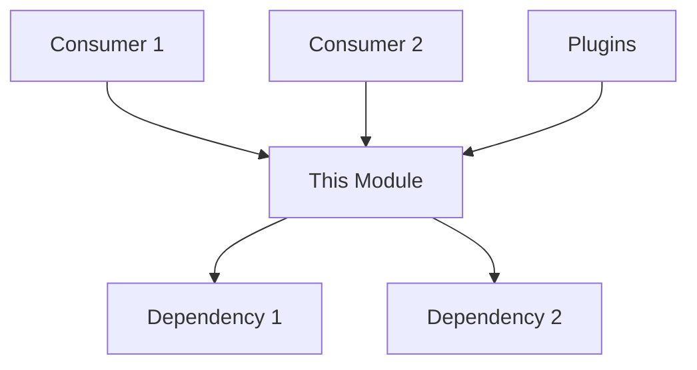

# Core Architecture Spec Template

**File naming:** `docs/specs/<task-id>_<module-name>.md`
**Rule:** This file must exist and be reviewed BEFORE writing any code for this task.
**Scope:** Core infrastructure, not plugins. For plugins, use `_TEMPLATE.md`.

---

## Task: [TASK-ID] — [Module Name]

**What This Module Does**

*2–3 sentences. What problem does it solve? What does it produce?*

---

## Architecture Decisions

*Why does this module exist as a separate component? What design pattern does it follow? What alternatives were considered?*

- **Pattern:** [e.g., Abstract Factory, Singleton, Observer]
- **Rationale:** *Why this pattern for this component*
- **Constraints:** *What this design must always guarantee (e.g., thread safety, 60 FPS, platform independence)*

---

## Legacy References

*Actual file paths and code from VJlive-1 and VJlive-2 that this module replaces or evolves.*

| Codebase | File | Class/Function | Status |
|----------|------|----------------|--------|
| VJlive-1 | `path/to/file.py` | `ClassName` | Port / Evolve / Replace |
| VJlive-2 | `path/to/file.py` | `ClassName` | Port / Evolve / Replace |

---

## Public Interface

```python
# Paste planned class/function signatures here before coding

class MyModule:
    def __init__(self, param: Type) -> None:...
    def method(self, arg: Type) -> ReturnType:...
```

---

## Platform Abstraction

*How does this module behave on different platforms?*

| Platform | Implementation | Hardware | Notes |
|----------|---------------|----------|-------|
| Linux ARM (OPi5) | `module_rk3588.py` | RK3588 NPU | Primary dev target |
| Linux x86 | `module_x86.py` | Intel/AMD GPU | Desktop/laptop |
| Windows | `module_windows.py` | DirectX | Surface, gaming rigs |

**Discovery mechanism:** *How does the module detect which platform it's running on and load the correct implementation?*

---

## Inputs and Outputs

| Name | Type | Description | Constraints |
|------|------|-------------|-------------|
| `param` | `type` | What it is | Range / valid values |

---

## Dependencies

- External libraries needed (and what happens if they are missing):
  - `library_name` — used for X — fallback: Y
- Internal modules this depends on:
  - `vjlive3.module.ClassName`
- **Modules that depend on THIS module:**
  - `vjlive3.other.Module` — uses X
  - `vjlive3.plugins.*` — all plugins consume this interface

---

## Dependency Graph



---

## What This Module Does NOT Do

*Explicit scope boundaries. What belongs in other modules.*

- Does NOT do X — that's `other_module`'s job
- Does NOT handle Y — plugins are responsible for that

---

## Edge Cases and Error Handling

| Scenario | Expected Behavior |
|----------|------------------|
| Hardware not present | Graceful fallback to software/mock |
| Performance degradation | Auto-reduce quality to maintain FPS |
| Hot reload | Module can restart without crashing pipeline |

---

## Test Plan

*List the tests that will verify this module before the task is marked done.*

| Test Name | What It Verifies |
|-----------|-----------------|
| `test_init_no_hardware` | Module starts without crashing if hardware absent |
| `test_basic_operation` | Core function returns expected output |
| `test_platform_detection` | Correct implementation loaded per platform |
| `test_error_handling` | Bad input raises correct exception |
| `test_cleanup` | stop() / close() releases resources cleanly |
| `test_performance` | Meets 60 FPS target under normal load |

**Minimum coverage:** 80% before task is marked done.

---

## Definition of Done

- [ ] Spec reviewed (by Manager or User before code starts)
- [ ] Legacy references verified against actual codebase
- [ ] Mermaid dependency graph reviewed
- [ ] Platform abstraction strategy approved
- [ ] All tests listed above pass
- [ ] No file over 750 lines
- [ ] No stubs in code
- [ ] Verification checkpoint box checked
- [ ] Git commit with `[Phase-X] task-id: description` message
- [ ] BOARD.md updated
- [ ] Lock released
- [ ] AGENT_SYNC.md handoff note written
