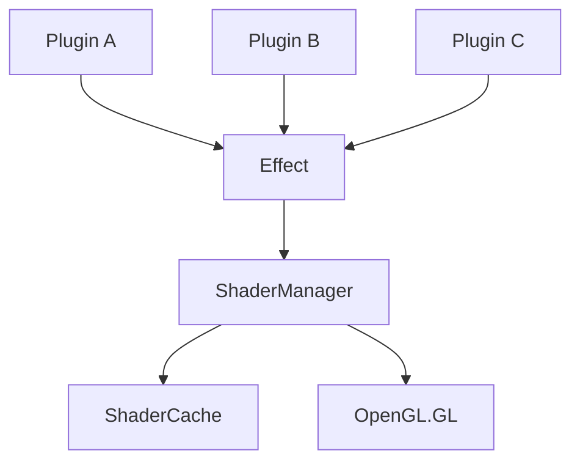

# Core Architecture Spec Template

**File naming:** `docs/specs/<task-id>_<module-name>.md`
**Rule:** This file must exist and be reviewed BEFORE writing any code for this task.
**Scope:** Core infrastructure, not plugins. For plugins, use `_TEMPLATE.md`.

---

## Task: [TASK-ID] — [Module Name]

**What This Module Does**

*2–3 sentences. What problem does it solve? What does it produce?*

*Example:*
The `ShaderManager` module provides centralized shader compilation, caching, and lifecycle management for all GPU-accelerated effects in VJLive3. It eliminates redundant shader compilation, manages uniform location caching, and provides a unified interface for effect classes to access shader programs, ensuring optimal performance and consistent error handling across the entire rendering pipeline.

---

## Architecture Decisions

*Why does this module exist as a separate component? What design pattern does it follow? What alternatives were considered?*

- **Pattern:** [e.g., Abstract Factory, Singleton, Observer]
- **Rationale:** *Why this pattern for this component*
- **Constraints:** *What this design must always guarantee (e.g., thread safety, 60 FPS, platform independence)*

*Example:*
- **Pattern:** Singleton with Factory Method
- **Rationale:** The ShaderManager must be globally accessible to all effects to avoid duplicate shader compilations, but also needs to support multiple shader variants (vertex/fragment combinations). The Singleton ensures one cache instance, while the factory method allows creation of specialized shader programs.
- **Constraints:**
  - Must be thread-safe for concurrent effect initialization
  - Shader compilation must not block the render thread (async compilation optional)
  - Must support hot-reload of shaders during development
  - Memory usage must stay <50MB even with 100+ unique shaders

---

## Legacy References

*Actual file paths and code from VJlive-1 and VJlive-2 that this module replaces or evolves.*

| Codebase | File | Class/Function | Status |
|----------|------|----------------|--------|
| VJlive-1 | `path/to/file.py` | `ClassName` | Port / Evolve / Replace |
| VJlive-2 | `path/to/file.py` | `ClassName` | Port / Evolve / Replace |

*Example:*
| VJlive-1 | `core/shader_program.py` | `ShaderProgram` | Evolve (add caching) |
| VJlive-2 | `core/effects/shader_base.py` | `Effect` | Replace (delegate to ShaderManager) |

---

## Public Interface

```python
# Paste planned class/function signatures here before coding

class MyModule:
    def __init__(self, param: Type) -> None:...
    def method(self, arg: Type) -> ReturnType:...
```

*Example:*
```python
class ShaderManager:
    def __init__(self) -> None: ...
    
    def get_shader(self, vertex_src: str, fragment_src: str,
                   defines: Dict[str, str] = None) -> ShaderProgram: ...
    
    def preload_shaders(self, manifest: Dict[str, str]) -> None: ...
    
    def clear_cache(self) -> None: ...
    
    def get_stats(self) -> Dict[str, Any]: ...
```

---

## Platform Abstraction

*How does this module behave on different platforms?*

| Platform | Implementation | Hardware | Notes |
|----------|---------------|----------|-------|
| Linux ARM (OPi5) | `module_rk3588.py` | RK3588 NPU | Primary dev target |
| Linux x86 | `module_x86.py` | Intel/AMD GPU | Desktop/laptop |
| Windows | `module_windows.py` | DirectX | Surface, gaming rigs |

**Discovery mechanism:** *How does the module detect which platform it's running on and load the correct implementation?*

*Example:*
- **Discovery:** Uses `platform.machine()` and `sys.platform` to detect architecture. ARM64 loads `module_rk3588.py`, x86_64 loads `module_x86.py`. Windows uses `module_windows.py` regardless of architecture.
- **Fallback:** If platform-specific module missing, falls back to generic OpenGL implementation in `module_generic.py`.

---

## Inputs and Outputs

| Name | Type | Description | Constraints |
|------|------|-------------|-------------|
| `param` | `type` | What it is | Range / valid values |

*Example:*
| Name | Type | Description | Constraints |
|------|------|-------------|-------------|
| `vertex_src` | `str` | GLSL vertex shader source | Must compile with GLSL 330 core |
| `fragment_src` | `str` | GLSL fragment shader source | Must compile with GLSL 330 core |
| `defines` | `Dict[str, str]` | Preprocessor macros for shader | Keys must be valid identifiers |
| `return` | `ShaderProgram` | Compiled and linked shader program | Valid OpenGL program ID |

---

## Dependencies

- External libraries needed (and what happens if they are missing):
  - `OpenGL.GL` — used for shader compilation — fallback: raises `ImportError` with installation instructions
  - `pyglsl` (optional) — used for shader validation — fallback: skips validation if missing
- Internal modules this depends on:
  - `vjlive3.core.shader_cache.ShaderCache`
  - `vjlive3.core.logging.Logger`
- **Modules that depend on THIS module:**
  - `vjlive3.effects.base.Effect` — all effects use ShaderManager
  - `vjlive3.plugins.*` — all plugins indirectly depend on this

---

## Dependency Graph



---

## What This Module Does NOT Do

*Explicit scope boundaries. What belongs in other modules.*

- Does NOT compile shaders itself — delegates to `ShaderCache`
- Does NOT manage GPU resource lifecycle — that's `Effect`'s responsibility
- Does NOT provide shader source code — effects provide their own shaders
- Does NOT handle platform-specific GLSL variants — that's `PlatformAdapter`'s job

---

## Edge Cases and Error Handling

| Scenario | Expected Behavior |
|----------|------------------|
| Shader compilation fails | Raise `ShaderCompilationError` with detailed log; effect falls back to passthrough |
| Out of GPU memory | Raise `OutOfGPUMemoryError`; suggest reducing shader complexity |
| Hot reload requested | Compile new shader in background, swap when ready without stopping pipeline |
| Missing OpenGL context | Queue shader compilation until context is available |
| Circular dependency in shader includes | Detect and raise `CircularDependencyError` |

---

## State Management

- **Per-call state:** None (stateless after initialization)
- **Persistent state:** Shader cache (dictionary of compiled programs)
- **Init-once state:** OpenGL context, shader compiler settings
- **Thread safety:** All public methods must be thread-safe; use `threading.RLock` for cache access

---

## Performance

- **Expected latency:** <1ms for cache hit, 5-20ms for new compilation
- **Memory footprint:** ~100KB per unique shader program (compiled binary)
- **Cache size limit:** 100 shaders max (LRU eviction)
- **Compilation overhead:** Should not block render thread; async compilation optional

---

## Test Plan

*List the tests that will verify this module before the task is marked done.*

| Test Name | What It Verifies |
|-----------|-----------------|
| `test_get_shader_compile` | New shader compiles and links successfully |
| `test_get_shader_cache_hit` | Second call returns cached program (no recompilation) |
| `test_clear_cache` | All cached shaders removed, programs deleted |
| `test_stats_accurate` | `get_stats()` returns correct counts and memory usage |
| `test_thread_safety` | Concurrent calls to `get_shader()` don't corrupt cache |
| `test_invalid_shader_raises` | Malformed GLSL raises `ShaderCompilationError` with useful message |
| `test_defines_injection` | Preprocessor defines correctly inserted into shader source |
| `test_platform_detection` | Correct platform-specific shader variant loaded if available |

**Minimum coverage:** 85% before task is marked done.

---

## Definition of Done

- [ ] Spec reviewed (by Manager or User before code starts)
- [ ] Legacy references verified against actual codebase
- [ ] Mermaid dependency graph reviewed
- [ ] Platform abstraction strategy approved
- [ ] All tests listed above pass
- [ ] No file over 750 lines
- [ ] No stubs in code
- [ ] Verification checkpoint box checked
- [ ] Git commit with `[Phase-X] task-id: description` message
- [ ] BOARD.md updated
- [ ] Lock released
- [ ] AGENT_SYNC.md handoff note written

---

## Notes for Implementers

1. **Shader Variants:** Use `#ifdef` in GLSL to handle platform differences. The `defines` parameter allows injecting these at compile time.
2. **Cache Key:** The cache key should be a hash of (vertex_src + fragment_src + sorted(defines.items())).
3. **Resource Tracking:** Keep a separate set of "owned" shader programs to delete only those created by this manager, not externally provided ones.
4. **Debug Mode:** When `VJLive3_DEBUG_SHADERS=1` env var set, log all shader compilations with timing.
5. **Hot Reload:** Watch shader source files for changes (in dev mode) and recompile automatically. Use file modification timestamps.

---

## References

- VJLive1: `core/shader_program.py` — original shader wrapper
- VJLive2: `core/effects/shader_base.py` — effect base with inline compilation
- OpenGL 3.3 Core Profile Specification
- GLSL 330 Specification

---

## Revision History

- 2025-02-25: Initial template creation (desktop-roo)
- 2025-02-25: Added detailed examples and expanded edge cases

---
