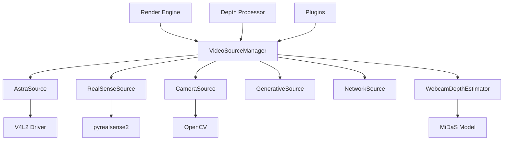

# Golden Example — Core Architecture Spec

**This is a REFERENCE EXAMPLE, not a real task. It shows what a completed core spec looks like.**
**Use `_CORE_TEMPLATE.md` for real specs.**

---

## Task: P1-R3 — Video Source Abstraction

**What This Module Does**

Provides a unified interface for all video input sources (webcams, depth cameras, network streams, generative sources). Any plugin or render pipeline consumer calls the same API regardless of whether the source is an Orbbec Astra, Intel RealSense, USB webcam, or software-generated pattern. Platform-specific implementations are discovered at runtime.

---

## Architecture Decisions

- **Pattern:** Abstract Factory + Strategy
- **Rationale:** Multiple camera types need the same interface. New cameras should be addable without modifying existing code. Runtime platform detection selects the correct implementation.
- **Constraints:**
  - Must deliver frames at ≥30 FPS for real sources
  - Must not crash if hardware is absent — fall back to test pattern
  - Must support both RGB and depth data through the same interface
  - Thread-safe: sources run in background threads, consumers read from main thread

---

## Legacy References

| Codebase | File | Class/Function | Status |
|----------|------|----------------|--------|
| VJlive-1 | `core/video_source.py` | `VideoSource` | Evolve — basic webcam only |
| VJlive-2 | `core/video/sources/base.py` | `BaseVideoSource` | Port — good abstraction |
| VJlive-2 | `core/video/sources/astra.py` | `AstraSource` | Port — Orbbec depth camera |
| VJlive-2 | `core/video/sources/astra_linux.py` | `AstraLinuxSource` | Port — Linux-specific Orbbec |
| VJlive-2 | `core/video/sources/realsense.py` | `RealSenseSource` | Port — Intel depth camera |
| VJlive-2 | `core/video/sources/camera.py` | `CameraSource` | Port — generic USB webcam |
| VJlive-2 | `core/video/sources/generative.py` | `GenerativeSource` | Port — software test patterns |
| VJlive-2 | `core/video/sources/network.py` | `NetworkSource` | Port — RTMP/NDI input |
| VJlive-2 | `core/video/sources/manager.py` | `VideoSourceManager` | Evolve — needs hot-plug support |
| VJlive-2 | `drivers/arm_opi5/v4l2_depth_source.py` | `V4L2DepthSource` | Port — OPi5 depth via V4L2 |
| VJlive-2 | `drivers/x86_windows/surface_ir_source.py` | `SurfaceIRSource` | Evaluate — Surface IR depth |
| VJlive-2 | `core/webcam_depth_estimator.py` | `WebcamDepthEstimator` | Port — ML depth from RGB |

---

## Public Interface

```python
from abc import ABC, abstractmethod
from dataclasses import dataclass
from enum import Enum
from typing import Optional
import numpy as np


class SourceType(Enum):
    RGB = "rgb"
    DEPTH = "depth"
    RGBD = "rgbd"          # Both RGB and depth
    GENERATIVE = "generative"
    NETWORK = "network"


@dataclass
class FrameData:
    """Container for a single frame from any source."""
    rgb: Optional[np.ndarray]      # (H, W, 3) uint8 or None
    depth: Optional[np.ndarray]    # (H, W) uint16/float32 or None
    timestamp: float               # Monotonic seconds
    source_id: str                 # Which source produced this
    frame_number: int


class VideoSource(ABC):
    """Abstract base for all video input sources."""

    @abstractmethod
    def start(self) -> None: ...

    @abstractmethod
    def stop(self) -> None: ...

    @abstractmethod
    def read_frame(self) -> Optional[FrameData]: ...

    @property
    @abstractmethod
    def source_type(self) -> SourceType: ...

    @property
    @abstractmethod
    def resolution(self) -> tuple[int, int]: ...

    @property
    @abstractmethod
    def is_available(self) -> bool: ...


class VideoSourceManager:
    """Discovers, manages, and hot-swaps video sources."""

    def discover_sources(self) -> list[VideoSource]: ...
    def get_source(self, source_id: str) -> Optional[VideoSource]: ...
    def get_primary_source(self) -> VideoSource: ...
    def set_primary_source(self, source_id: str) -> None: ...
    def on_source_connected(self, callback) -> None: ...
    def on_source_disconnected(self, callback) -> None: ...
```

---

## Platform Abstraction

| Platform | Implementation | Hardware | Notes |
|----------|---------------|----------|-------|
| Linux ARM (OPi5) | `sources/v4l2_depth.py` | Orbbec Astra via V4L2 | Primary depth target |
| Linux x86 | `sources/realsense.py` | Intel RealSense | USB depth camera |
| Linux x86 | `sources/camera.py` | Any USB webcam | V4L2 / OpenCV |
| Windows | `sources/surface_ir.py` | Surface IR camera | Windows Media Foundation |
| Any | `sources/network.py` | NDI / RTMP stream | Platform-independent |
| Any | `sources/generative.py` | None (software) | Test patterns, noise |
| Any | `sources/webcam_depth.py` | Any webcam + ML | MiDaS/DPT depth estimation |

**Discovery mechanism:** `VideoSourceManager.discover_sources()` probes available hardware using platform-specific checks (V4L2 on Linux, WMF on Windows) and returns all available `VideoSource` implementations. Falls back to `GenerativeSource` if no hardware found.

---

## Inputs and Outputs

| Name | Type | Description | Constraints |
|------|------|-------------|-------------|
| `frame` | `FrameData` | RGB/depth frame from source | Resolution varies by source |
| `source_type` | `SourceType` | RGB, depth, or RGBD | Set at source creation |
| `resolution` | `(int, int)` | Width × height | Min 320×240, max 3840×2160 |

---

## Dependencies

- External:
  - `opencv-python` — camera capture fallback — required
  - `pyrealsense2` — Intel RealSense — optional, graceful fallback
  - `openni2` — Orbbec Astra — optional, graceful fallback
  - `numpy` — frame data — required
- Internal:
  - `vjlive3.core.thread_manager` — background capture threads
  - `vjlive3.core.config` — source preferences and calibration
- **Modules that depend on THIS module:**
  - `vjlive3.render.engine` — consumes frames for GPU pipeline
  - `vjlive3.plugins.*` — all depth/video plugins read from sources
  - `vjlive3.core.vision.depth_processor` — depth map processing

---

## Dependency Graph



---

## What This Module Does NOT Do

- Does NOT process or transform frames — that's `depth_processor` and plugins
- Does NOT render anything — that's `render.engine`
- Does NOT handle video OUTPUT (Spout/NDI send) — that's `video.output_mapper`
- Does NOT manage shader compilation — that's `render.shader_compiler`

---

## Edge Cases and Error Handling

| Scenario | Expected Behavior |
|----------|------------------|
| Camera not plugged in | `is_available` returns False, `discover_sources()` skips it |
| Camera unplugged mid-stream | `read_frame()` returns None, fires `on_source_disconnected` |
| Camera plugged in while running | `on_source_connected` fires, source becomes available |
| No cameras at all | Falls back to `GenerativeSource` (test pattern) |
| Multiple cameras | All discovered, user selects primary via manager |
| Permission denied (Linux) | Clear error message: "Add user to `video` group" |

---

## Test Plan

| Test Name | What It Verifies |
|-----------|-----------------|
| `test_init_no_hardware` | Manager starts with GenerativeSource as fallback |
| `test_generative_source_frames` | GenerativeSource produces valid FrameData |
| `test_frame_data_structure` | FrameData has correct types and shapes |
| `test_source_discovery` | discover_sources() returns available sources |
| `test_source_start_stop` | Source lifecycle works without leaking threads |
| `test_read_frame_returns_none` | Disconnected source returns None gracefully |
| `test_hot_swap_callback` | on_source_connected fires when source added |
| `test_primary_source_fallback` | Primary auto-falls back if disconnected |
| `test_thread_safety` | Multiple consumers can read from same source |

**Minimum coverage:** 80% before task is marked done.

---

## Definition of Done

- [x] Spec reviewed ← **This is a golden example**
- [x] Legacy references verified against actual codebase
- [x] Mermaid dependency graph reviewed
- [x] Platform abstraction strategy approved
- [ ] All tests listed above pass
- [ ] No file over 750 lines
- [ ] No stubs in code
- [ ] Verification checkpoint box checked
- [ ] Git commit with `[Phase-X] task-id: description` message
- [ ] BOARD.md updated
- [ ] Lock released
- [ ] AGENT_SYNC.md handoff note written
